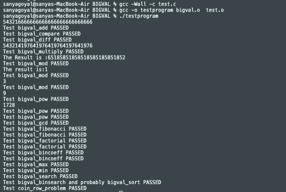

# BigVal
The maximum limit of Unsigned Long Int in C/C++ is 18446744073709551615, a 20 digit
number. While languages like C++/Java support classes of BigIntegers (100 digit numbers).
C by default has no such support.This project aims to bring that support to the C language
along with basic arithmetic operations like Comparison, Addition, Subtraction, and
Multiplication along with applications such as Factorial, Fibonacci, etc.

% gcc -Wall -c bigval.c
% gcc -Wall -c test.c
Now we link them together to produce our final executable:
% gcc -o testprogram bigval.o  test.o

bigval is a nonnegative integer of arbitrary length, but it is sufficient for your implementation to support up to 1000 decimal digits. The integer is stored as a null-terminated string of ASCII characters. An intal is represented as a string of decimal digits ('0' thru '9') that are stored in the big-endian style. That is, the most significant digit is at the head of the string. An integer 25, for example, is stored in a string s as '2' at s[0], '5' at s[1], and null char at s[2].
 It is guaranteed that the inputs never expect an answer crossing the 1000 digit limit.

a) Currently bigval can store only non negative integers. We can expand the 
      implementation to include the negative numbers as well.
      b) We can improve this library by adding more functionalites like 
      division, square root, logarithm, etc. The fundamental functions such as 
      addition, comparison, subtraction and multiplication are already 
      implemented, which can be used by more complex functions.

  3.2. Different Approaches
      a) Using linked list, where each node is a digit.
      b) Using hexadecimal or even higher order bases to represent the numbers, 
      as it would then require lesser number of characters.
output

